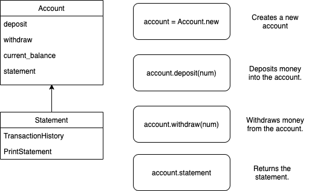
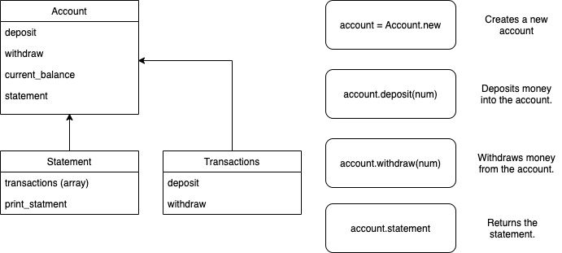
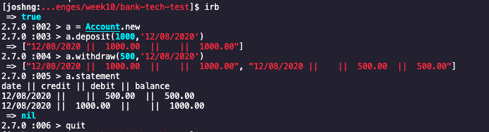

# Bank tech test

Today, you'll practice doing a tech test.

For most tech tests, you'll essentially have unlimited time.  This practice session is about producing the best code you can when there is a minimal time pressure.

You'll get to practice your OO design and TDD skills.

You'll work alone, and you'll also review your own code so you can practice reflecting on and improving your own work.

## Specification

### User story

As a customer,
So that I can save money.
I want to open a bank account with a deposit

As a customer,
So that I can continue adding to my savings,
I want to be able to deposit into my back account

As a customer,
So that I can spend my money that I've saved,
I want to be able to withdraw money from my bank account.

As a customer,
So that I can keep track of what I'm spending,
I want to be able to print out a statment of my spending with dates.

### Planning 
```
Class: Account

Methods: .deposit
         .withdraw
         .statement
```

```
Input:                  ||    Output:
account.deposit(100)          => 100
account.withdraw(50)          => 50
account.withdraw(1000)        => "Your withdrawal exceeds your current balance."
account.statement             => date || credit || debit || balance
                            11/08/2020 ||       ||  50   || 50
                            11/08/2020 ||  100  ||       || 100

```
V1


V2


V3


### Notes

#### My approach and thoughts

My approach was to build a simple program and then spread out the separate methods into classes.
I started with the creation of the account class then moved into creating the deposit, withdraw and statement methods.
I did also create a statement class but at the time of writing, this is a WIP.

I had the most trouble with my statement method where most of my focus was kept. This was due to multiple factors such as returning the statement correctly as well as trying various different things to get the statement to appear in the correct format.

I structured the code to be easily readable and to have 100% test coverage.
But I also structured it in a way that it can allow for easy moving to other classes.

#### Screenshot of working app



### How to run program

1. Fork or Clone this repo.
2. Run bundle install.
3. Run 'irb' in your console.
4. In the console type; require './lib/account.rb'
5. Then to create a new account type; account = Account.new
6. At this stage you have several commands, 'account.deposit(amount), account.withdraw(amount), account.statement'

### How to run tests

1. Fork or Clone this repo.
2. Run bundle install.
3. Run rspec in file to see tests.

### Requirements

* You should be able to interact with your code via a REPL like IRB or the JavaScript console.  (You don't need to implement a command line interface that takes input from STDIN.)
* Deposits, withdrawal.
* Account statement (date, amount, balance) printing.
* Data can be kept in memory (it doesn't need to be stored to a database or anything).

### Acceptance criteria

**Given** a client makes a deposit of 1000 on 10-01-2012  
**And** a deposit of 2000 on 13-01-2012  
**And** a withdrawal of 500 on 14-01-2012  
**When** she prints her bank statement  
**Then** she would see

```
date || credit || debit || balance
14/01/2012 || || 500.00 || 2500.00
13/01/2012 || 2000.00 || || 3000.00
10/01/2012 || 1000.00 || || 1000.00
```

## Self-assessment

Once you have completed the challenge and feel happy with your solution, here's a form to help you reflect on the quality of your code: https://docs.google.com/forms/d/1Q-NnqVObbGLDHxlvbUfeAC7yBCf3eCjTmz6GOqC9Aeo/edit

